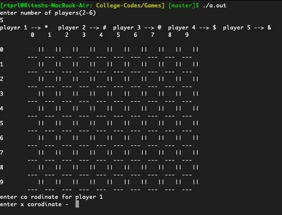
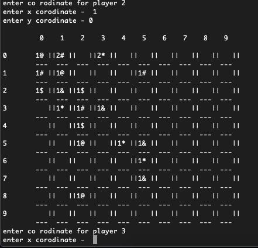

# ChainReaction
[Chain Reaction](https://play.google.com/store/apps/details?id=com.BuddyMattEnt.ChainReaction&hl=en_IN&gl=US) is a single device multiplayer game which did evolve with time to support multiple devices. It seemed simple but interesting which inspired me to code out the game. I implemented the basic logic and made a console game where user can play by giving co ordinates of the cell where he wants to give input. Its an exact working solution of that game just the UI and User control was inferior as it had to run on terminal and I had no knowledge of APP UI. Now lets see what it is.


 ## Instructions
 Compile and run using this command
```bash
 $ gcc chainreaction.c
 $ ./a.out
 ```
 
 ### How to play
1. Its a multiplayer game (upto 6 players) with square grid play ground where each player has his own unique color (for my console game I used different symbols for each player like `*`, `#`, `$`, `&`) like this.

 

2. The 4 corner cells has a capablity to hold max 1 element, edge cells (edges x length - corners i.e. `4*10-4=36` cells) have capablity to hold max 2 elements and all the other cells can have 3 elements max. One cell can con contain only same type of elements (i.e. all `@` or all `#` or all `*`).

3. In each turn a player places his element on his desired location which is either an empty cell or a cell which already consists of his element(s).

4. Every time a cell exceeds its capablity of number of elements it bursts horizontally left or right and vertically up or down. Each corner cell burst with 2 elements, edge cells with 3 and other cells with 4 elements. 

5. When a cell bursts all elements in it scatters towards adjacent cells based on rule 4. The scattered elements then gallops the cell it goes to and make all the elements in making it of its color. 

6. After each move this Bursting and galloping continues in chain till the whole grid reaches stability. When there is only one color (in my game symbol) present in the grid the owner of that color wins the game. 

This game is written in C. I wish to make this as an App with a few tweaks to be able to play across multiple devices over the internet.


### Future plan

1. Another attempt to optimize the code and the display : `blocked.c`. The code is not yet complete.
2. Create Dynamic grid size and add animation.
